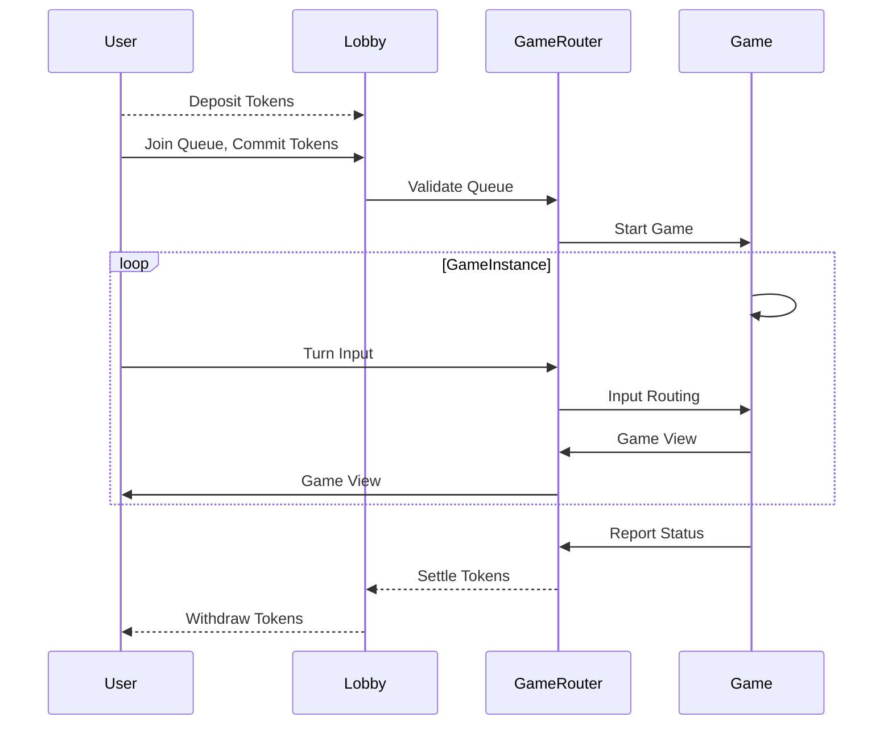

# Bulldog Blast

Bulldog Blast is a proof-of-concept semi-realtime multiplayer arcade combat game.
It runs entirely on the Internet Computer. The components are structured to work within a flexible, token-integrated architecture. 
The following is a typical workflow:


The dotted lines are pending future work on ERC-20 integration.

```
nix-shell
sh start.sh
dfx deploy
```
